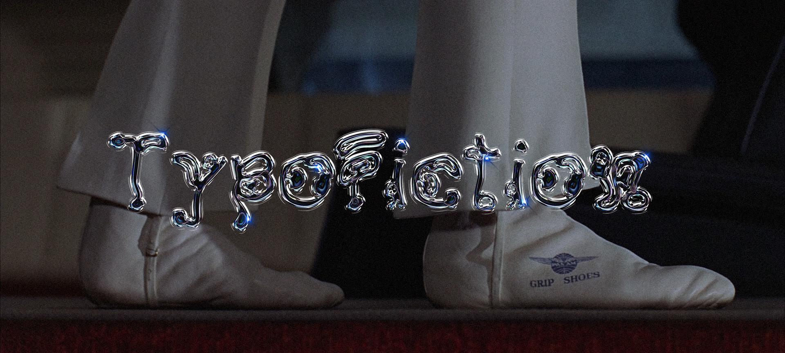

# TypoFiction
TypoFiction

Typography as a building block in world-building practices.
In this workshop, we introduce the participants to the concept of asemic writing as a tool to questioning the system of meaning and famous applications in fiction film making.
Within the workshop, the participants were introduced to the technicalities of lettering and building a fictional script in a form of a digital font.
The workshop is facilitated by Mohamed Gaber and Farah Fayyad as part of TypeLab workshops at Sandberg Instituut.
